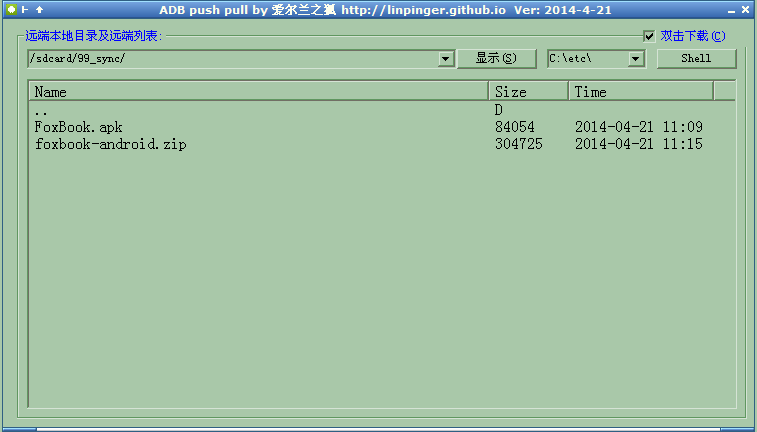

# FoxADBGUI

**功能:** adb(Android Debug Bridge) 的 GUI，主要用来和android设备互传中文名文件

**适用范围:** windows

**语言:** [Autohotkey](http://www.autohotkey.com)

**缘起:** 4.x的设备在XP下不好访问，通过adb可以传文件，但对中文名的文件处理起来就乱码了，在网上找了一个相对比较完美的支持中文的adb程序

## adb.exe说明:
- 在网上找了一圈adb，就这位大大(wanliaixie)的一个版本支持中文比较完美
- 在这里下载的: (http://download.csdn.net/download/wanliaixie/6286541)
- **注意:** 该 adb.exe 依赖 msvcp90.dll msvcr90.dll

## 下载

**Exe打包下载:**

 - [FoxADBGUI.exe](../../releases/download/FoxADBGUI/FoxADBGUI.exe)
 - <http://pan.baidu.com/s/1bnqxdjL>

**源码:**

 - [FoxADBGUI.ahkL](FoxADBGUI.ahkL)

## 用法

- **安装:** 在开发者选项里面打开usb调试，然后装好自己设备的adb驱动，然后运行本程序即可
- **注意:** 该 adb.exe 依赖 msvcp90.dll msvcr90.dll
- 打开程序
- 上传到设备: 在explorer或TC选中要上传的文件(可多选),拖动到界面最大的列表框中，就一个个的上传
- 下载到本地: 双击要下载的文件列表

## 截图

## 更新日志

- 2014-5-4: 添加移动菜单以及F2修改文件名的功能，都是调用mv命令
- 2014-4-21: 第一个发布版
